# Code Quality MLOps Architecture

## High-Level Architecture Flow

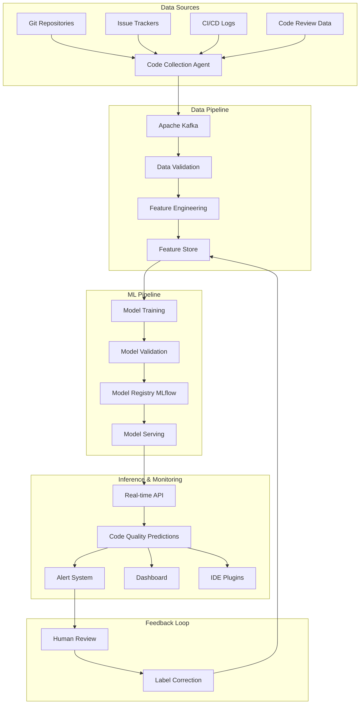

## Detailed Component Architecture

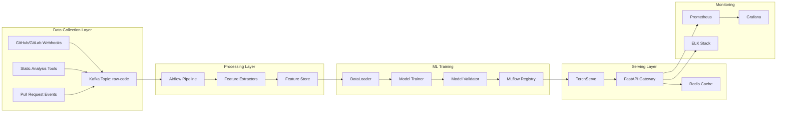

## Data Flow Pipeline

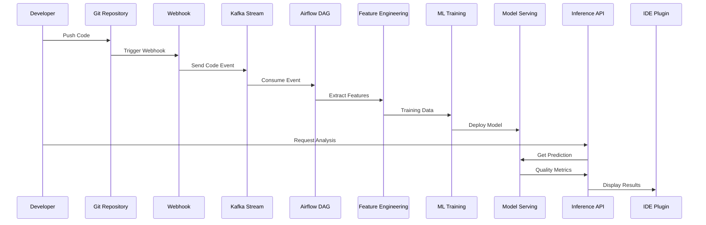

## Feature Engineering Pipeline

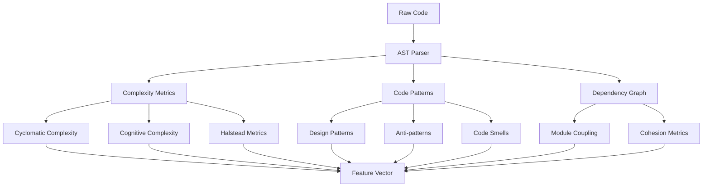

## Detailed Tool-Based Pipeline Architecture

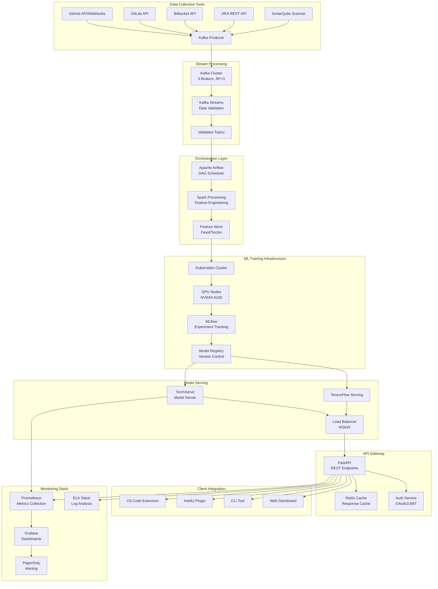

## Cost-Optimized Architecture Views

### Premium Architecture ($2,895/month)
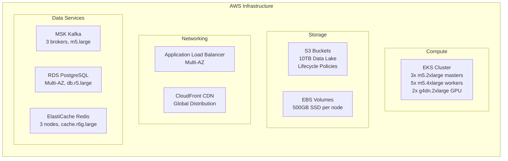

### Cost-Optimized Architecture ($1,250/month)
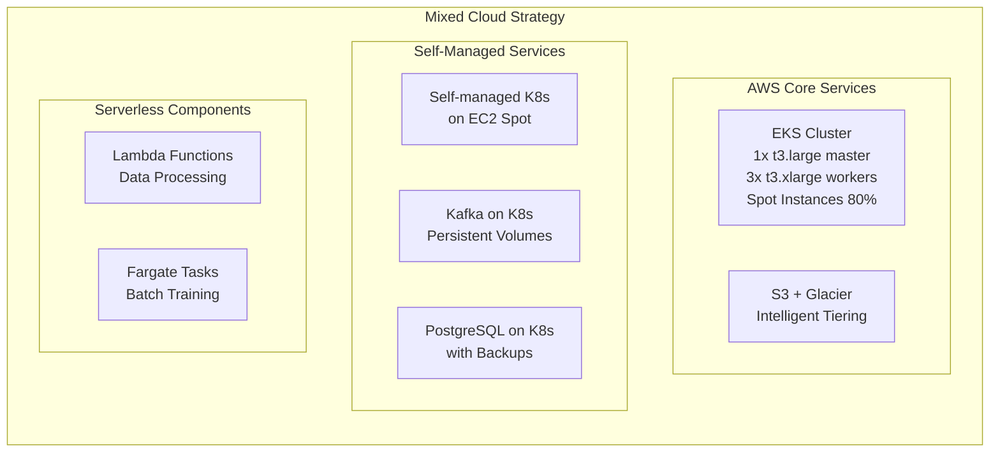

### Startup/MVP Architecture ($300/month)
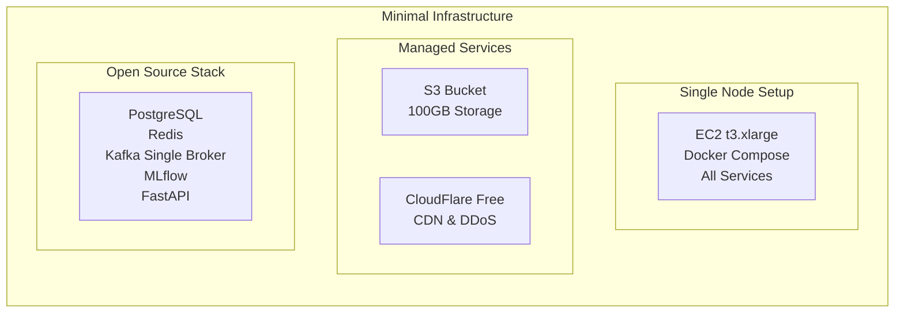

## ML Model Training Pipeline

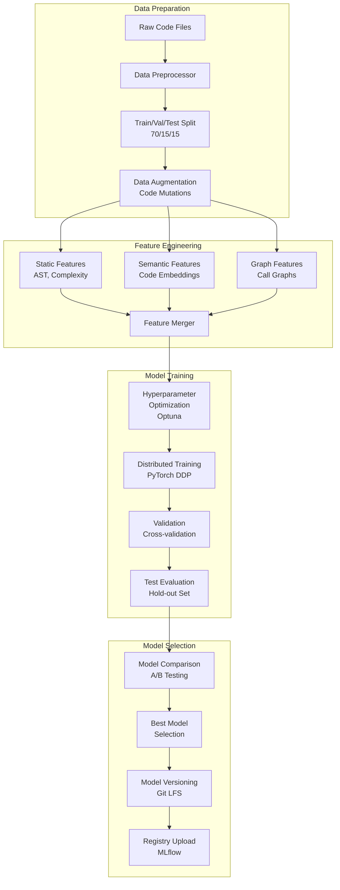

## Real-time Inference Pipeline

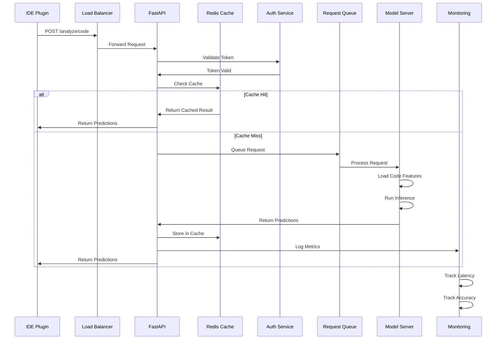

## Continuous Learning Pipeline

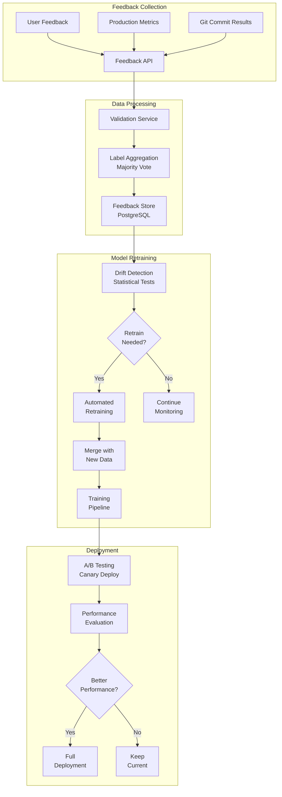

## Security Architecture

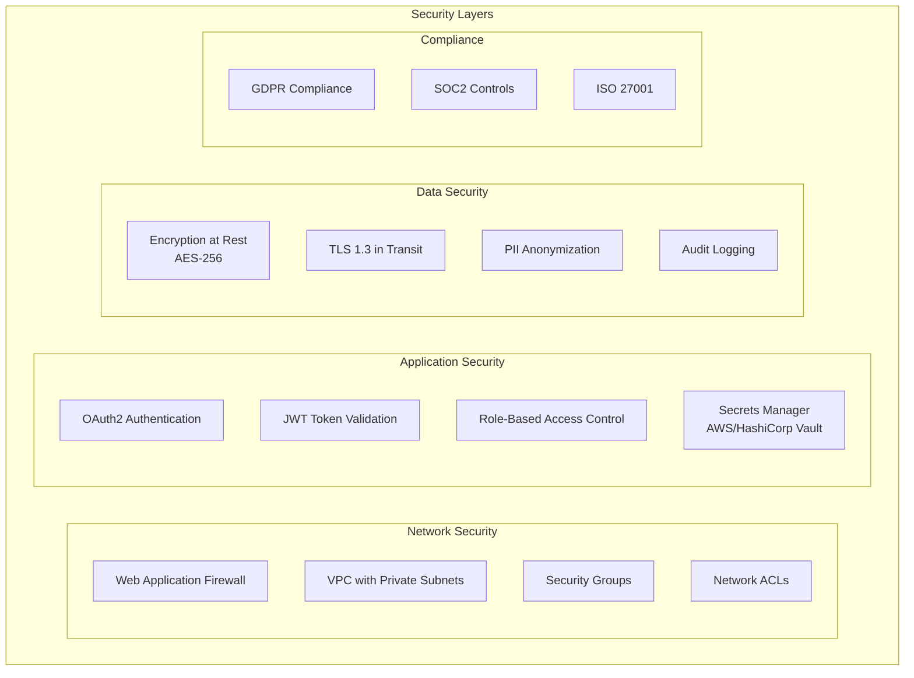