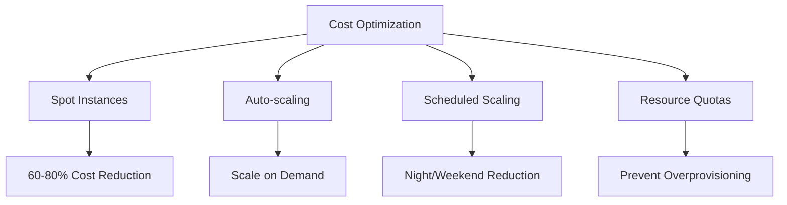
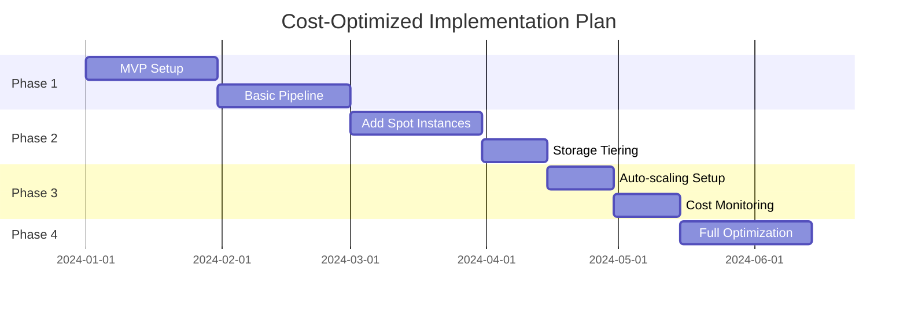
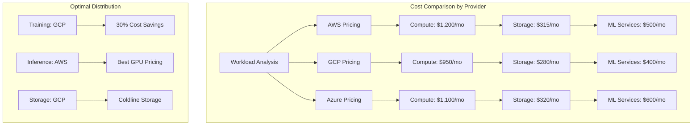
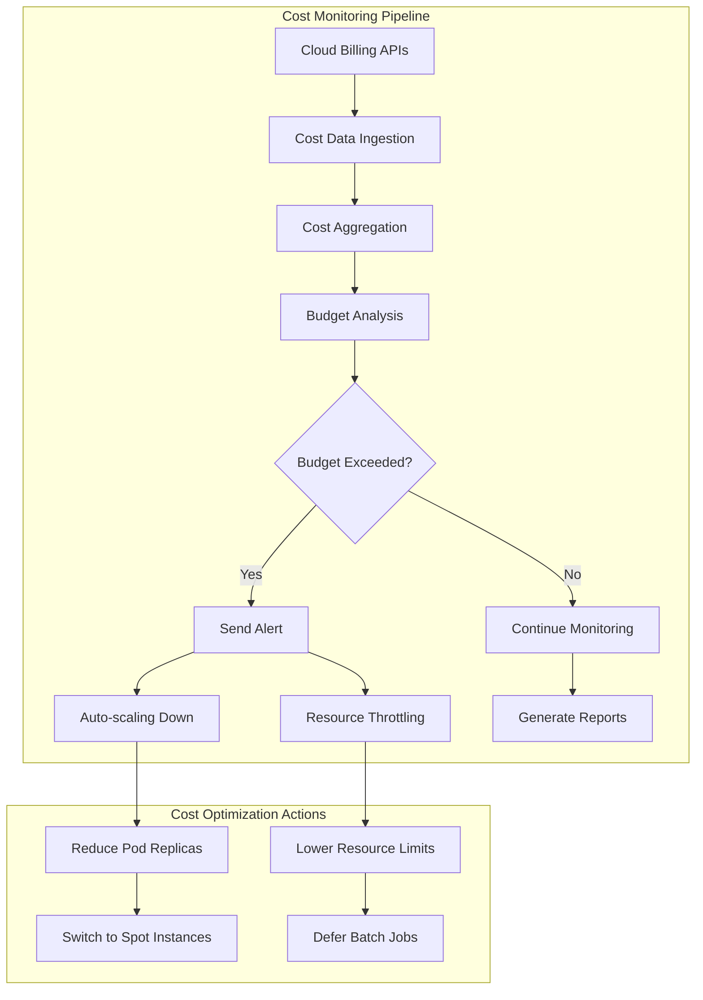

# Cost Optimization Strategy for Code Quality MLOps Pipeline

## Cost Analysis by Component

### 1. Infrastructure Costs (Monthly Estimates)

```yaml
kubernetes_cluster:
  # Development Environment
  dev:
    node_pool:
      - type: n2-standard-4  # 4 vCPU, 16GB RAM
        count: 2
        cost: $240/month
    total: $240/month
  
  # Production Environment
  prod:
    node_pool:
      - type: n2-standard-8  # 8 vCPU, 32GB RAM
        count: 3
        spot_instances: true  # 60-80% cost savings
        cost: $360/month
      - type: n1-highmem-4  # ML workloads
        count: 2
        gpu: nvidia-t4
        cost: $800/month
    load_balancer: $20/month
    total: $1,180/month

storage:
  # Data Lake (S3/GCS)
  raw_data: 
    size: 5TB
    cost: $115/month
  processed_data:
    size: 1TB
    cost: $23/month
  model_artifacts:
    size: 500GB
    cost: $12/month
  
  # Database (PostgreSQL)
  metadata_db:
    type: db.t3.medium
    storage: 100GB
    cost: $75/month
  
  # Feature Store (Redis)
  cache:
    type: cache.m5.large
    cost: $90/month
    
  total: $315/month
```

### 2. Compute Optimization Strategies



#### Auto-scaling Configuration

```yaml
# Horizontal Pod Autoscaler
apiVersion: autoscaling/v2
kind: HorizontalPodAutoscaler
metadata:
  name: api-hpa
spec:
  scaleTargetRef:
    apiVersion: apps/v1
    kind: Deployment
    name: code-quality-api
  minReplicas: 2
  maxReplicas: 10
  metrics:
  - type: Resource
    resource:
      name: cpu
      target:
        type: Utilization
        averageUtilization: 70
  - type: Resource
    resource:
      name: memory
      target:
        type: Utilization
        averageUtilization: 80
  behavior:
    scaleDown:
      stabilizationWindowSeconds: 300
      policies:
      - type: Percent
        value: 50
        periodSeconds: 60
```

### 3. Data Pipeline Cost Optimization

```python
# Batch Processing Strategy
class CostOptimizedPipeline:
    def __init__(self):
        self.batch_config = {
            'small_files': {
                'batch_size': 1000,
                'process_interval': '1h',
                'instance_type': 'n2-standard-2'
            },
            'large_files': {
                'batch_size': 100,
                'process_interval': '30m',
                'instance_type': 'n2-standard-4'
            }
        }
    
    def optimize_processing(self, file_size):
        if file_size < 10_000:  # Lines of code
            return self.batch_config['small_files']
        else:
            return self.batch_config['large_files']
    
    def schedule_jobs(self):
        # Run intensive jobs during off-peak hours
        off_peak_hours = range(22, 6)  # 10 PM - 6 AM
        return {
            'model_training': off_peak_hours,
            'batch_inference': range(2, 5),  # 2 AM - 5 AM
            'feature_engineering': 'continuous',
            'real_time_api': '24/7'
        }
```

### 4. Model Serving Optimization

```yaml
model_serving_tiers:
  tier_1_critical:
    # Real-time, low-latency requirements
    deployment: kubernetes
    replicas: 3-10 (auto-scaled)
    gpu: optional
    cache: redis (1GB)
    monthly_cost: $400
    
  tier_2_standard:
    # Batch predictions, moderate latency
    deployment: serverless (Cloud Run)
    concurrency: 100
    memory: 2GB
    monthly_cost: $150 (pay-per-use)
    
  tier_3_batch:
    # Offline analysis, high latency tolerance
    deployment: spot_instances
    schedule: nightly
    monthly_cost: $50
```

### 5. Storage Optimization

```python
# Intelligent Data Lifecycle Management
data_lifecycle_policies = {
    'raw_code_files': {
        'hot_storage': '7_days',
        'warm_storage': '30_days',  # Infrequent access
        'cold_storage': '90_days',  # Archive
        'delete_after': '1_year'
    },
    'features': {
        'hot_storage': '30_days',
        'warm_storage': '90_days',
        'compression': 'gzip',
        'format': 'parquet'  # 70% size reduction vs JSON
    },
    'model_artifacts': {
        'keep_latest': 5,
        'archive_others': True,
        'compression': 'zstd'
    }
}
```

## Total Cost Breakdown

### Option 1: Full-Scale Production (Premium)
```yaml
infrastructure:
  kubernetes: $1,180/month
  storage: $315/month
  networking: $100/month
  monitoring: $150/month
  
ml_services:
  training_compute: $500/month
  inference_api: $400/month
  
third_party:
  github_actions: $50/month
  datadog_apm: $200/month
  
total: $2,895/month
annual: $34,740
```

### Option 2: Cost-Optimized (Recommended)
```yaml
infrastructure:
  kubernetes_spot: $600/month  # 50% savings
  storage_tiered: $200/month   # 35% savings
  networking: $50/month
  monitoring_oss: $0/month     # Prometheus/Grafana
  
ml_services:
  training_scheduled: $200/month  # Off-peak only
  inference_serverless: $150/month
  
third_party:
  github_free: $0/month
  elastic_basic: $50/month
  
total: $1,250/month
annual: $15,000
savings: 57% reduction
```

### Option 3: Startup/MVP (Minimal)
```yaml
infrastructure:
  cloud_run: $100/month
  storage_minimal: $50/month
  
ml_services:
  training_on_demand: $100/month
  inference_batch: $50/month
  
total: $300/month
annual: $3,600
```

## Cost Monitoring Dashboard

```python
# Cost tracking implementation
class CostMonitor:
    def __init__(self):
        self.alerts = {
            'daily_budget': 100,  # USD
            'weekly_budget': 600,
            'monthly_budget': 2000
        }
    
    def track_costs(self):
        return {
            'compute': self.get_compute_costs(),
            'storage': self.get_storage_costs(),
            'network': self.get_network_costs(),
            'ml_training': self.get_training_costs()
        }
    
    def optimization_recommendations(self, usage_data):
        recommendations = []
        
        if usage_data['cpu_utilization'] < 30:
            recommendations.append({
                'action': 'Downsize instances',
                'savings': '$200/month'
            })
        
        if usage_data['storage_access_frequency'] < 0.1:
            recommendations.append({
                'action': 'Move to cold storage',
                'savings': '$50/month'
            })
        
        return recommendations
```

## ROI Analysis

```yaml
cost_benefit_analysis:
  costs:
    initial_setup: $10,000
    monthly_operational: $1,250
    annual_total: $25,000
    
  benefits:
    bug_reduction:
      current_bug_fix_time: 8_hours
      bugs_per_month: 50
      time_saved: 40%  # 160 hours/month
      value: $16,000/month
      
    code_review_efficiency:
      current_review_time: 2_hours
      reviews_per_month: 200
      time_saved: 30%  # 120 hours/month
      value: $12,000/month
      
    security_incident_prevention:
      avg_incident_cost: $50,000
      incidents_prevented: 2/year
      value: $8,333/month
      
  total_monthly_benefit: $36,333
  roi: 1353%
  payback_period: 0.8_months
```

## Implementation Timeline



## Advanced Cost Optimization Strategies

### Multi-Cloud Cost Arbitrage



### Dynamic Resource Allocation

```python
# Smart resource scheduler
class DynamicResourceManager:
    def __init__(self):
        self.pricing_models = {
            'on_demand': {'cost_multiplier': 1.0, 'availability': 100},
            'spot': {'cost_multiplier': 0.3, 'availability': 80},
            'preemptible': {'cost_multiplier': 0.2, 'availability': 70},
            'reserved': {'cost_multiplier': 0.6, 'availability': 100}
        }
    
    def optimize_workload(self, workload_type, urgency_level):
        if workload_type == 'training':
            if urgency_level == 'low':
                return self.schedule_spot_instances()
            elif urgency_level == 'medium':
                return self.hybrid_scheduling()
            else:
                return self.on_demand_fallback()
        
        elif workload_type == 'inference':
            return self.inference_optimization()
    
    def schedule_spot_instances(self):
        return {
            'instance_type': 'spot',
            'retry_policy': 'exponential_backoff',
            'max_retries': 3,
            'fallback': 'on_demand',
            'cost_savings': '70%'
        }
    
    def hybrid_scheduling(self):
        return {
            'critical_components': 'reserved_instances',
            'batch_processing': 'spot_instances',
            'api_serving': 'on_demand',
            'cost_savings': '45%'
        }

# Usage pattern analysis
usage_patterns = {
    'weekday_peak': {
        'hours': '9:00-17:00',
        'scaling_factor': 1.5,
        'instance_strategy': 'on_demand'
    },
    'weekend_low': {
        'hours': '00:00-23:59',
        'scaling_factor': 0.3,
        'instance_strategy': 'spot'
    },
    'training_window': {
        'hours': '02:00-06:00',
        'scaling_factor': 3.0,
        'instance_strategy': 'preemptible'
    }
}
```

### Intelligent Caching Strategy

```yaml
# Multi-tier caching configuration
caching_strategy:
  level_1_hot_cache:
    technology: Redis Cluster
    size: 16GB
    ttl: 1h
    cost: $90/month
    hit_ratio: 85%
    
  level_2_warm_cache:
    technology: Memcached
    size: 64GB
    ttl: 24h
    cost: $150/month
    hit_ratio: 65%
    
  level_3_cold_cache:
    technology: S3 with CloudFront
    size: 1TB
    ttl: 7d
    cost: $40/month
    hit_ratio: 40%
    
  cache_invalidation:
    strategy: time_based_with_events
    refresh_triggers:
      - model_update
      - feature_schema_change
      - user_feedback_threshold

# Cache effectiveness monitoring
cache_metrics:
  cost_per_request:
    without_cache: $0.002
    with_l1_cache: $0.0002
    with_l2_cache: $0.0005
    with_l3_cache: $0.001
  
  savings_calculation:
    daily_requests: 1_000_000
    l1_hit_rate: 0.85
    l2_hit_rate: 0.65
    l3_hit_rate: 0.40
    total_savings: $1,200/month
```

### Model Optimization for Cost Reduction

```python
# Model compression and quantization
class ModelOptimizer:
    def __init__(self):
        self.optimization_techniques = {
            'quantization': {
                'fp32_to_int8': {'size_reduction': 4, 'accuracy_loss': 0.02},
                'dynamic_quantization': {'size_reduction': 2, 'accuracy_loss': 0.01}
            },
            'pruning': {
                'structured': {'size_reduction': 3, 'accuracy_loss': 0.03},
                'unstructured': {'size_reduction': 2.5, 'accuracy_loss': 0.02}
            },
            'knowledge_distillation': {
                'teacher_student': {'size_reduction': 10, 'accuracy_loss': 0.05}
            }
        }
    
    def optimize_for_deployment(self, model, target_platform):
        if target_platform == 'edge':
            return self.aggressive_optimization(model)
        elif target_platform == 'cloud':
            return self.balanced_optimization(model)
        else:
            return model
    
    def calculate_cost_savings(self, original_model_size, optimized_size):
        serving_cost_per_gb = 50  # Monthly cost per GB
        storage_cost_per_gb = 10  # Monthly storage cost per GB
        
        size_reduction = original_model_size - optimized_size
        monthly_savings = size_reduction * (serving_cost_per_gb + storage_cost_per_gb)
        
        return {
            'monthly_savings': monthly_savings,
            'annual_savings': monthly_savings * 12,
            'size_reduction_ratio': optimized_size / original_model_size
        }

# Model serving optimization
serving_configurations = {
    'real_time_critical': {
        'optimization_level': 'minimal',
        'latency_target': '<100ms',
        'cost_per_request': '$0.002',
        'use_case': 'IDE plugins'
    },
    'batch_processing': {
        'optimization_level': 'aggressive',
        'latency_target': '<10s',
        'cost_per_request': '$0.0002',
        'use_case': 'CI/CD pipeline'
    },
    'background_analysis': {
        'optimization_level': 'maximum',
        'latency_target': '<60s',
        'cost_per_request': '$0.00005',
        'use_case': 'Nightly reports'
    }
}
```

### Container and Kubernetes Cost Optimization

```yaml
# Resource quotas and limits optimization
resource_optimization:
  development:
    cpu_request: 100m
    cpu_limit: 500m
    memory_request: 256Mi
    memory_limit: 512Mi
    cost_per_pod_hour: $0.05
    
  staging:
    cpu_request: 250m
    cpu_limit: 1000m
    memory_request: 512Mi
    memory_limit: 1Gi
    cost_per_pod_hour: $0.12
    
  production:
    cpu_request: 500m
    cpu_limit: 2000m
    memory_request: 1Gi
    memory_limit: 2Gi
    cost_per_pod_hour: $0.25

# Vertical Pod Autoscaler configuration
vpa_config:
  updateMode: "Auto"
  resourcePolicy:
    containerPolicies:
    - containerName: api
      maxAllowed:
        cpu: 2
        memory: 4Gi
      minAllowed:
        cpu: 100m
        memory: 128Mi
      controlledResources: ["cpu", "memory"]
  
# Node affinity for cost optimization
node_affinity:
  spot_instances:
    nodeAffinity:
      preferredDuringSchedulingIgnoredDuringExecution:
      - weight: 100
        preference:
          matchExpressions:
          - key: node.kubernetes.io/instance-type
            operator: In
            values: ["spot"]
    tolerations:
    - key: spot
      operator: Equal
      value: "true"
      effect: NoSchedule
```

### Data Pipeline Cost Optimization

```python
# Intelligent data processing scheduler
class DataPipelineOptimizer:
    def __init__(self):
        self.processing_tiers = {
            'immediate': {
                'latency': '<5min',
                'cost_multiplier': 3.0,
                'instance_type': 'on_demand'
            },
            'standard': {
                'latency': '<1hour',
                'cost_multiplier': 1.0,
                'instance_type': 'spot'
            },
            'batch': {
                'latency': '<12hours',
                'cost_multiplier': 0.3,
                'instance_type': 'preemptible'
            }
        }
    
    def classify_data_urgency(self, data_metadata):
        if data_metadata.get('source') == 'production_incident':
            return 'immediate'
        elif data_metadata.get('is_blocking_deployment'):
            return 'standard'
        else:
            return 'batch'
    
    def optimize_processing_schedule(self, data_queue):
        optimized_schedule = []
        
        for data_item in data_queue:
            urgency = self.classify_data_urgency(data_item.metadata)
            processing_config = self.processing_tiers[urgency]
            
            optimized_schedule.append({
                'data_id': data_item.id,
                'processing_tier': urgency,
                'estimated_cost': data_item.size * processing_config['cost_multiplier'],
                'sla': processing_config['latency']
            })
        
        return optimized_schedule

# Data lifecycle cost optimization
data_lifecycle_optimization = {
    'code_repositories': {
        'active_analysis': {
            'retention': '30_days',
            'storage_class': 'hot',
            'cost_per_gb': '$0.023'
        },
        'historical_trends': {
            'retention': '1_year',
            'storage_class': 'cold',
            'cost_per_gb': '$0.004'
        },
        'archive': {
            'retention': '7_years',
            'storage_class': 'glacier',
            'cost_per_gb': '$0.001'
        }
    },
    'model_artifacts': {
        'current_production': {
            'storage_class': 'hot',
            'replicas': 3,
            'cost_per_gb': '$0.023'
        },
        'candidate_models': {
            'storage_class': 'warm',
            'replicas': 2,
            'cost_per_gb': '$0.012'
        },
        'experimental_models': {
            'storage_class': 'cold',
            'replicas': 1,
            'cost_per_gb': '$0.004'
        }
    }
}
```

## Cost Monitoring and Alerting



### Real-time Cost Dashboard

```python
# Cost dashboard metrics
dashboard_metrics = {
    'real_time_costs': {
        'current_hourly_rate': '$15.50/hour',
        'projected_monthly': '$11,160',
        'budget_remaining': '$3,840',
        'budget_utilization': '74%'
    },
    'cost_breakdown': {
        'compute': 65,  # percentage
        'storage': 20,
        'networking': 10,
        'ml_services': 5
    },
    'optimization_opportunities': [
        {
            'action': 'Migrate to spot instances',
            'potential_savings': '$2,400/month',
            'risk_level': 'medium'
        },
        {
            'action': 'Implement storage tiering',
            'potential_savings': '$800/month',
            'risk_level': 'low'
        },
        {
            'action': 'Optimize model serving',
            'potential_savings': '$1,200/month',
            'risk_level': 'medium'
        }
    ]
}

# Automated cost optimization recommendations
class CostOptimizationEngine:
    def __init__(self):
        self.thresholds = {
            'cpu_utilization_low': 20,
            'memory_utilization_low': 30,
            'storage_access_rare': 0.1  # Access frequency
        }
    
    def generate_recommendations(self, metrics):
        recommendations = []
        
        if metrics['cpu_utilization'] < self.thresholds['cpu_utilization_low']:
            recommendations.append({
                'type': 'rightsizing',
                'action': 'Reduce CPU allocation by 50%',
                'savings': '$200/month',
                'confidence': 0.9
            })
        
        if metrics['storage_access_frequency'] < self.thresholds['storage_access_rare']:
            recommendations.append({
                'type': 'storage_optimization',
                'action': 'Move to cold storage',
                'savings': '$150/month',
                'confidence': 0.95
            })
        
        return recommendations
```