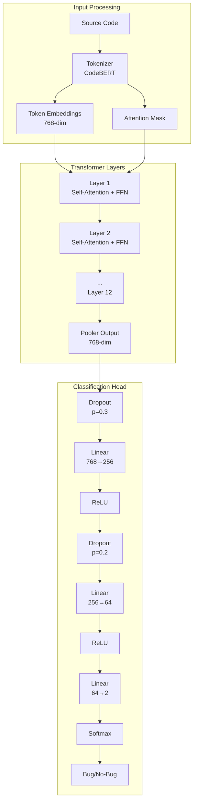
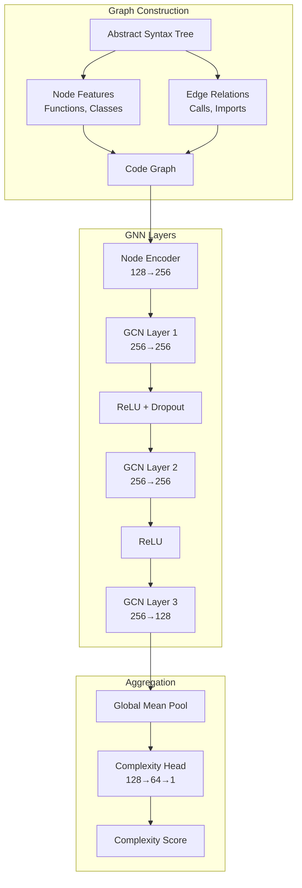
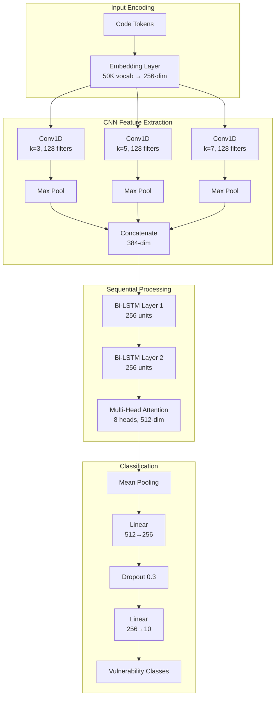
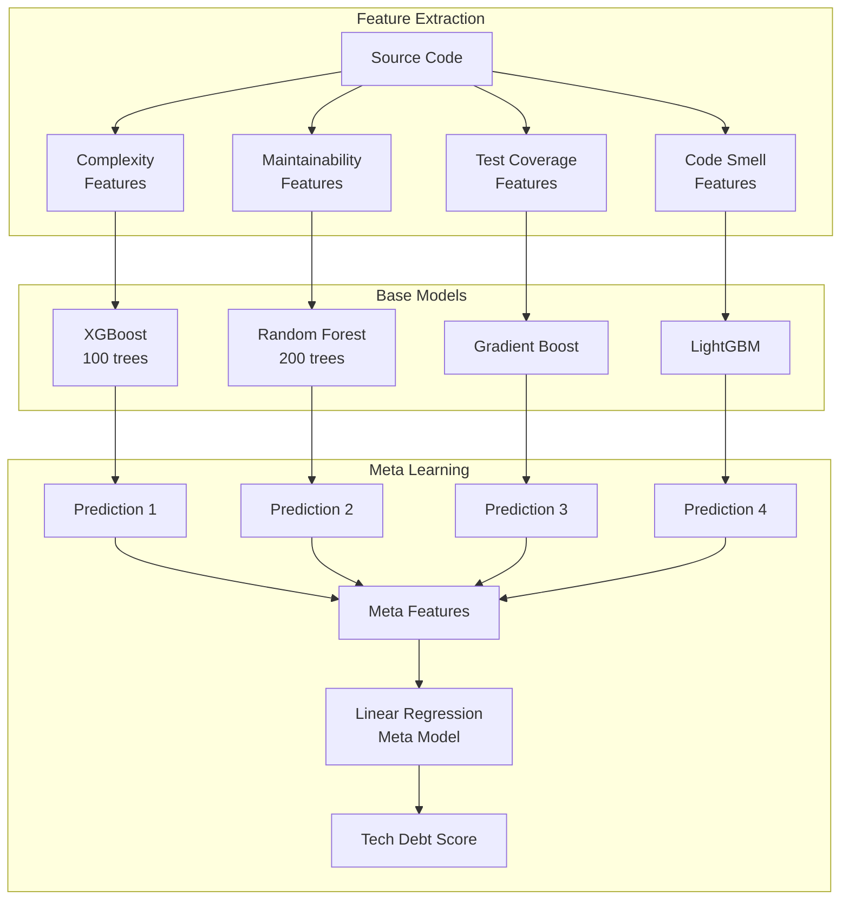
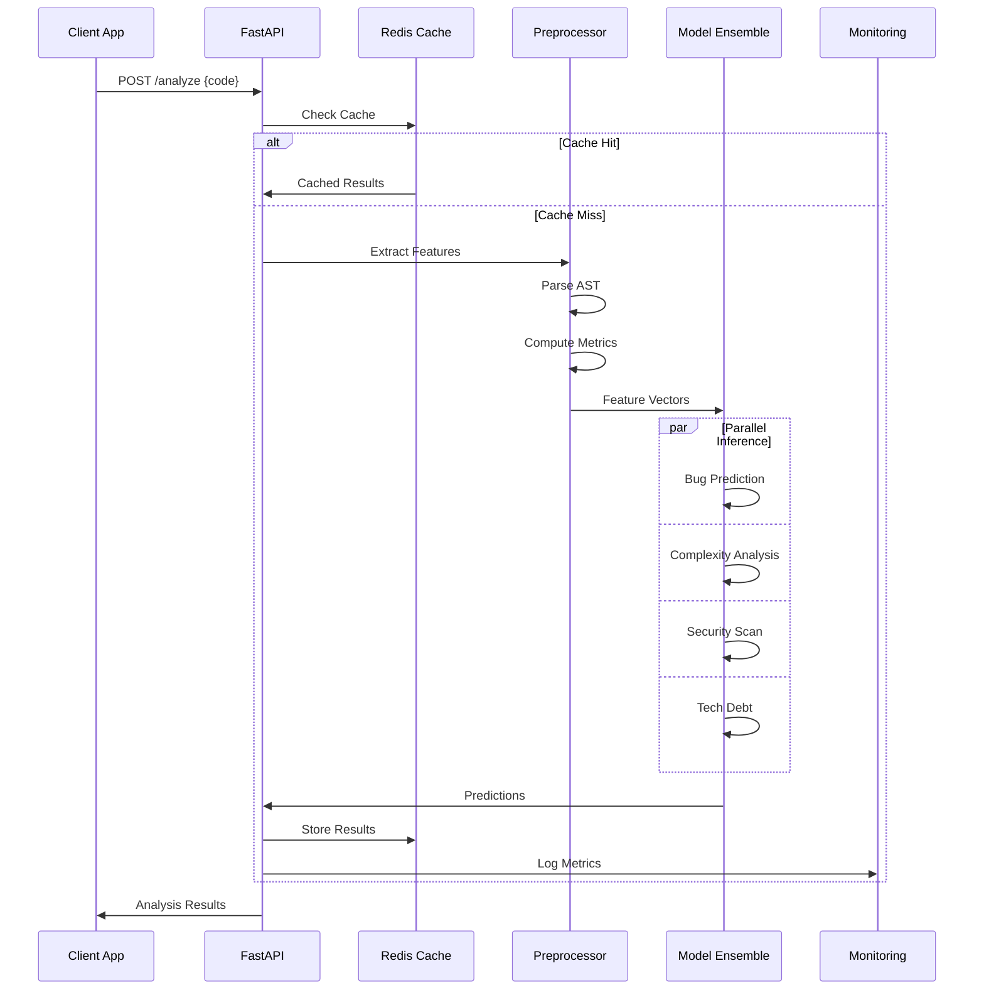
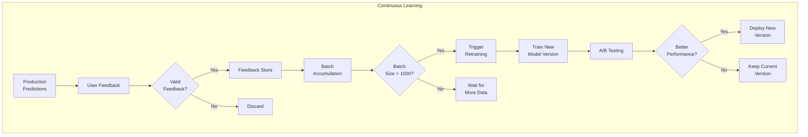
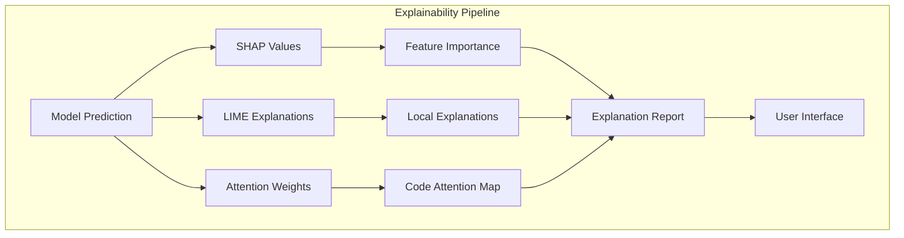

# ML Models for Code Quality Prediction

## 1. Bug Prediction Model

### Architecture: Code-BERT + Classification Head

```python
import torch
import torch.nn as nn
from transformers import RobertaModel, RobertaTokenizer

class BugPredictionModel(nn.Module):
    def __init__(self, pretrained_model='microsoft/codebert-base'):
        super().__init__()
        self.codebert = RobertaModel.from_pretrained(pretrained_model)
        self.dropout = nn.Dropout(0.3)
        self.classifier = nn.Sequential(
            nn.Linear(768, 256),
            nn.ReLU(),
            nn.Dropout(0.2),
            nn.Linear(256, 64),
            nn.ReLU(),
            nn.Linear(64, 2)  # Binary classification: bug/no-bug
        )
        
    def forward(self, input_ids, attention_mask):
        outputs = self.codebert(input_ids=input_ids, attention_mask=attention_mask)
        pooled = outputs.pooler_output
        pooled = self.dropout(pooled)
        logits = self.classifier(pooled)
        return logits
```

### Features Used:
- Code tokens and AST structure
- Historical bug patterns
- Code complexity metrics
- Developer experience signals
- Code review comments

### Training Data:
```yaml
dataset:
  positive_samples:
    - Buggy code from issue trackers
    - Code before bug-fix commits
    - Security vulnerability examples
  negative_samples:
    - Stable production code
    - Well-tested modules
    - Code after bug fixes
  
  size: 1M+ code samples
  languages: Python, Java, JavaScript, Go
  balance: 30% positive, 70% negative
```

## 2. Code Complexity Analyzer

### Architecture: Graph Neural Network (GNN)

```python
import torch
import torch.nn.functional as F
from torch_geometric.nn import GCNConv, global_mean_pool

class ComplexityGNN(nn.Module):
    def __init__(self, node_features=128, hidden_dim=256):
        super().__init__()
        self.node_encoder = nn.Linear(node_features, hidden_dim)
        self.conv1 = GCNConv(hidden_dim, hidden_dim)
        self.conv2 = GCNConv(hidden_dim, hidden_dim)
        self.conv3 = GCNConv(hidden_dim, 128)
        
        self.complexity_head = nn.Sequential(
            nn.Linear(128, 64),
            nn.ReLU(),
            nn.Linear(64, 1)  # Complexity score
        )
        
    def forward(self, x, edge_index, batch):
        # Node embedding
        x = self.node_encoder(x)
        x = F.relu(x)
        
        # Graph convolutions
        x = F.relu(self.conv1(x, edge_index))
        x = F.dropout(x, p=0.3, training=self.training)
        x = F.relu(self.conv2(x, edge_index))
        x = self.conv3(x, edge_index)
        
        # Graph-level pooling
        x = global_mean_pool(x, batch)
        
        # Complexity prediction
        complexity = self.complexity_head(x)
        return complexity
```

### Graph Construction:
- Nodes: Functions, classes, modules
- Edges: Function calls, imports, inheritance
- Node features: Cyclomatic complexity, LOC, parameters

## 3. Security Vulnerability Scanner

### Architecture: CNN-LSTM Hybrid

```python
class SecurityScanner(nn.Module):
    def __init__(self, vocab_size=50000, embedding_dim=256):
        super().__init__()
        self.embedding = nn.Embedding(vocab_size, embedding_dim)
        
        # CNN for local pattern detection
        self.conv1 = nn.Conv1d(embedding_dim, 128, kernel_size=3)
        self.conv2 = nn.Conv1d(embedding_dim, 128, kernel_size=5)
        self.conv3 = nn.Conv1d(embedding_dim, 128, kernel_size=7)
        
        # LSTM for sequential patterns
        self.lstm = nn.LSTM(384, 256, num_layers=2, 
                           bidirectional=True, batch_first=True)
        
        # Attention mechanism
        self.attention = nn.MultiheadAttention(512, num_heads=8)
        
        # Classification head
        self.classifier = nn.Sequential(
            nn.Linear(512, 256),
            nn.ReLU(),
            nn.Dropout(0.3),
            nn.Linear(256, 10)  # 10 vulnerability categories
        )
        
    def forward(self, x):
        # Embedding
        x = self.embedding(x)
        x_t = x.transpose(1, 2)
        
        # CNN features
        conv1_out = F.relu(self.conv1(x_t))
        conv2_out = F.relu(self.conv2(x_t))
        conv3_out = F.relu(self.conv3(x_t))
        
        # Combine CNN outputs
        cnn_out = torch.cat([
            F.max_pool1d(conv1_out, conv1_out.size(2)),
            F.max_pool1d(conv2_out, conv2_out.size(2)),
            F.max_pool1d(conv3_out, conv3_out.size(2))
        ], dim=1).transpose(1, 2)
        
        # LSTM processing
        lstm_out, _ = self.lstm(cnn_out)
        
        # Self-attention
        attn_out, _ = self.attention(lstm_out, lstm_out, lstm_out)
        
        # Global pooling
        pooled = torch.mean(attn_out, dim=1)
        
        # Classification
        logits = self.classifier(pooled)
        return logits
```

### Vulnerability Categories:
1. SQL Injection
2. XSS (Cross-Site Scripting)
3. Buffer Overflow
4. Path Traversal
5. Insecure Deserialization
6. Hardcoded Credentials
7. Race Conditions
8. Memory Leaks
9. Cryptographic Weaknesses
10. Access Control Issues

## 4. Technical Debt Predictor

### Architecture: Ensemble Model

```python
class TechnicalDebtEnsemble:
    def __init__(self):
        self.models = {
            'complexity': XGBRegressor(n_estimators=100),
            'maintainability': RandomForestRegressor(n_estimators=200),
            'test_coverage': GradientBoostingRegressor(),
            'code_smells': LGBMRegressor()
        }
        self.meta_model = LinearRegression()
        
    def train(self, X, y):
        # Train base models
        predictions = []
        for name, model in self.models.items():
            model.fit(X[name], y)
            pred = model.predict(X[name])
            predictions.append(pred.reshape(-1, 1))
        
        # Train meta-model
        meta_features = np.hstack(predictions)
        self.meta_model.fit(meta_features, y)
        
    def predict(self, X):
        predictions = []
        for name, model in self.models.items():
            pred = model.predict(X[name])
            predictions.append(pred.reshape(-1, 1))
        
        meta_features = np.hstack(predictions)
        return self.meta_model.predict(meta_features)
```

### Feature Categories:
```yaml
complexity_features:
  - cyclomatic_complexity
  - cognitive_complexity
  - nesting_depth
  - parameter_count
  - line_count

maintainability_features:
  - code_duplication_ratio
  - coupling_between_objects
  - depth_of_inheritance
  - lack_of_cohesion
  - response_for_class

test_coverage_features:
  - line_coverage
  - branch_coverage
  - mutation_score
  - test_to_code_ratio
  - test_execution_time

code_smell_features:
  - long_method_count
  - large_class_count
  - feature_envy_score
  - data_clumps
  - primitive_obsession
```

## Model Training Pipeline

```python
# Training configuration
training_config = {
    'bug_prediction': {
        'batch_size': 32,
        'learning_rate': 2e-5,
        'epochs': 10,
        'warmup_steps': 1000,
        'gradient_accumulation': 4,
        'fp16': True
    },
    'complexity_analyzer': {
        'batch_size': 64,
        'learning_rate': 1e-3,
        'epochs': 50,
        'early_stopping_patience': 5
    },
    'security_scanner': {
        'batch_size': 128,
        'learning_rate': 1e-3,
        'epochs': 30,
        'class_weights': 'balanced'
    },
    'tech_debt_predictor': {
        'cv_folds': 5,
        'hyperparameter_tuning': True,
        'optimization_metric': 'rmse'
    }
}
```

## Model Performance Metrics

```yaml
bug_prediction:
  precision: 0.89
  recall: 0.84
  f1_score: 0.86
  auc_roc: 0.92

complexity_analyzer:
  mae: 2.3
  rmse: 3.1
  r2_score: 0.87
  
security_scanner:
  accuracy: 0.94
  macro_f1: 0.91
  weighted_f1: 0.93
  
technical_debt:
  correlation: 0.85
  mae: 0.12
  explained_variance: 0.82
```

## Detailed Model Architecture Diagrams

### Bug Prediction Model Architecture


### Code Complexity GNN Architecture


### Security Scanner CNN-LSTM Architecture


### Technical Debt Ensemble Architecture


## Training Pipeline Flow

```mermaid
graph LR
    subgraph "Data Collection"
        GIT[Git Repositories] --> CRAWLER[Code Crawler]
        ISSUES[Issue Trackers] --> CRAWLER
        CRAWLER --> RAW[Raw Dataset]
    end
    
    subgraph "Data Preprocessing"
        RAW --> CLEAN[Data Cleaning]
        CLEAN --> PARSE[AST Parsing]
        PARSE --> FEAT[Feature Extraction]
        FEAT --> SPLIT[Train/Val/Test Split<br/>70/15/15]
    end
    
    subgraph "Model Training"
        SPLIT --> AUG[Data Augmentation]
        AUG --> TRAIN[Distributed Training<br/>Multi-GPU]
        TRAIN --> VAL[Validation]
        VAL --> TUNE[Hyperparameter<br/>Tuning]
        TUNE --> BEST[Best Model<br/>Selection]
    end
    
    subgraph "Evaluation & Deployment"
        BEST --> TEST[Test Set<br/>Evaluation]
        TEST --> METRICS[Performance<br/>Metrics]
        METRICS --> DEPLOY{Deploy?}
        DEPLOY -->|Yes| REG[Model Registry]
        DEPLOY -->|No| TRAIN
    end
```



## Model Inference Pipeline



## Model Update Strategy



## Model Interpretability

