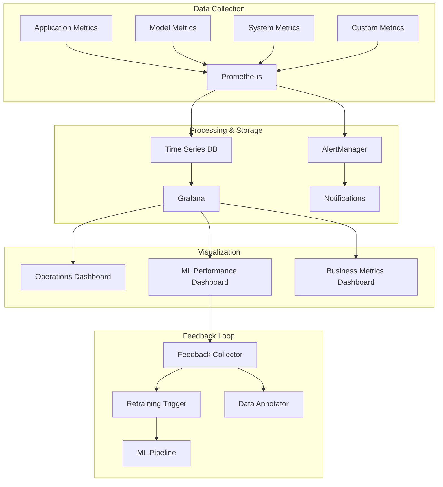
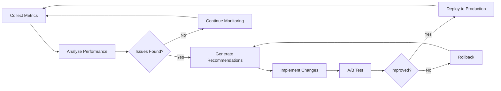

# Monitoring and Feedback System

## Real-time Monitoring Architecture



## Key Metrics to Monitor

### 1. Model Performance Metrics

```yaml
# Prometheus metrics configuration
model_metrics:
  # Prediction accuracy
  - name: model_prediction_accuracy
    type: gauge
    labels: [model_name, version]
    description: "Rolling accuracy of model predictions"
    
  # Inference latency
  - name: model_inference_duration_seconds
    type: histogram
    buckets: [0.01, 0.05, 0.1, 0.5, 1.0, 2.0, 5.0]
    labels: [model_name, endpoint]
    
  # Prediction confidence
  - name: model_prediction_confidence
    type: histogram
    buckets: [0.1, 0.2, 0.3, 0.4, 0.5, 0.6, 0.7, 0.8, 0.9, 1.0]
    labels: [model_name, prediction_class]
    
  # Model drift
  - name: model_feature_drift_score
    type: gauge
    labels: [model_name, feature_name]
    description: "KL divergence from training distribution"
```

### 2. Pipeline Health Metrics

```python
from prometheus_client import Counter, Histogram, Gauge
import time

# Pipeline metrics
pipeline_success = Counter('pipeline_runs_total', 
                          'Total pipeline runs',
                          ['pipeline_name', 'status'])

pipeline_duration = Histogram('pipeline_duration_seconds',
                            'Pipeline execution time',
                            ['pipeline_name', 'stage'])

data_quality_score = Gauge('data_quality_score',
                          'Data quality assessment score',
                          ['dataset', 'check_type'])

# Usage example
@pipeline_duration.labels('feature_engineering', 'extraction').time()
def extract_features(code_data):
    features = process_code(code_data)
    
    # Track data quality
    quality_score = assess_data_quality(features)
    data_quality_score.labels('features', 'completeness').set(quality_score)
    
    return features
```

### 3. Business Impact Metrics

```yaml
business_metrics:
  # Bug detection effectiveness
  bugs_detected:
    description: "Number of bugs caught before production"
    calculation: "true_positives / (true_positives + false_negatives)"
    target: "> 0.85"
    
  # Developer productivity
  code_review_time_saved:
    description: "Average time saved per code review"
    calculation: "baseline_review_time - automated_review_time"
    target: "> 30%"
    
  # False positive rate
  false_positive_rate:
    description: "Rate of incorrect bug predictions"
    calculation: "false_positives / total_predictions"
    target: "< 0.10"
    
  # Cost per prediction
  inference_cost:
    description: "Average cost per code analysis"
    calculation: "total_compute_cost / total_predictions"
    target: "< $0.01"
```

## Monitoring Dashboards

### 1. Operations Dashboard

```json
{
  "dashboard": {
    "title": "MLOps Operations Dashboard",
    "panels": [
      {
        "title": "API Request Rate",
        "query": "rate(http_requests_total[5m])",
        "type": "graph"
      },
      {
        "title": "Error Rate",
        "query": "rate(http_requests_total{status=~\"5..\"}[5m])",
        "type": "graph",
        "alert": {
          "condition": "> 0.01",
          "severity": "warning"
        }
      },
      {
        "title": "Latency P95",
        "query": "histogram_quantile(0.95, http_request_duration_seconds)",
        "type": "graph",
        "alert": {
          "condition": "> 1.0",
          "severity": "critical"
        }
      },
      {
        "title": "Resource Utilization",
        "queries": {
          "cpu": "avg(rate(container_cpu_usage_seconds_total[5m]))",
          "memory": "avg(container_memory_usage_bytes)",
          "gpu": "avg(nvidia_gpu_utilization)"
        },
        "type": "multi-graph"
      }
    ]
  }
}
```

### 2. ML Performance Dashboard

```python
# Grafana dashboard configuration
ml_dashboard = {
    "uid": "ml-performance",
    "title": "ML Model Performance",
    "panels": [
        {
            "gridPos": {"h": 8, "w": 12, "x": 0, "y": 0},
            "title": "Model Accuracy Trends",
            "targets": [{
                "expr": "model_prediction_accuracy",
                "legendFormat": "{{model_name}} v{{version}}"
            }]
        },
        {
            "gridPos": {"h": 8, "w": 12, "x": 12, "y": 0},
            "title": "Prediction Confidence Distribution",
            "targets": [{
                "expr": "histogram_quantile(0.5, model_prediction_confidence)",
                "legendFormat": "Median Confidence"
            }]
        },
        {
            "gridPos": {"h": 8, "w": 24, "x": 0, "y": 8},
            "title": "Feature Drift Detection",
            "targets": [{
                "expr": "model_feature_drift_score > 0.1",
                "legendFormat": "{{feature_name}}"
            }],
            "alert": {
                "name": "Feature Drift Detected",
                "conditions": [{
                    "evaluator": {"type": "gt", "params": [0.2]},
                    "reducer": {"type": "avg"},
                    "query": {"model": "A"}
                }]
            }
        }
    ]
}
```

## Feedback Collection System

### 1. User Feedback Interface

```python
from fastapi import FastAPI, HTTPException
from pydantic import BaseModel
import uuid

app = FastAPI()

class FeedbackSubmission(BaseModel):
    prediction_id: str
    actual_outcome: str
    user_feedback: str
    severity: str  # "critical", "major", "minor"
    
class FeedbackResponse(BaseModel):
    feedback_id: str
    status: str
    message: str

@app.post("/feedback", response_model=FeedbackResponse)
async def submit_feedback(feedback: FeedbackSubmission):
    feedback_id = str(uuid.uuid4())
    
    # Store feedback
    await store_feedback(feedback_id, feedback)
    
    # Trigger retraining if critical
    if feedback.severity == "critical":
        await trigger_immediate_retraining(feedback)
    
    # Update metrics
    update_feedback_metrics(feedback)
    
    return FeedbackResponse(
        feedback_id=feedback_id,
        status="accepted",
        message="Feedback recorded successfully"
    )
```

### 2. Automated Feedback Loop

```python
class FeedbackLoop:
    def __init__(self):
        self.feedback_threshold = 100  # Minimum feedback for retraining
        self.drift_threshold = 0.15
        self.accuracy_threshold = 0.80
        
    async def monitor_and_trigger(self):
        while True:
            # Check feedback volume
            feedback_count = await get_recent_feedback_count()
            if feedback_count >= self.feedback_threshold:
                await self.trigger_retraining("feedback_threshold_met")
            
            # Check model drift
            drift_score = await calculate_drift_score()
            if drift_score > self.drift_threshold:
                await self.trigger_retraining("drift_detected")
            
            # Check accuracy degradation
            current_accuracy = await get_model_accuracy()
            if current_accuracy < self.accuracy_threshold:
                await self.trigger_retraining("accuracy_degraded")
            
            await asyncio.sleep(3600)  # Check hourly
    
    async def trigger_retraining(self, reason):
        retraining_job = {
            'timestamp': datetime.utcnow(),
            'reason': reason,
            'current_metrics': await get_current_metrics(),
            'feedback_data': await get_feedback_data()
        }
        
        # Submit to training pipeline
        await submit_training_job(retraining_job)
```

## Alert Configuration

```yaml
# AlertManager configuration
alerts:
  - name: ModelAccuracyDegraded
    expr: model_prediction_accuracy < 0.80
    for: 10m
    labels:
      severity: critical
      team: ml-ops
    annotations:
      summary: "Model accuracy below threshold"
      description: "Model {{$labels.model_name}} accuracy is {{$value}}"
      
  - name: HighInferenceLatency
    expr: histogram_quantile(0.95, model_inference_duration_seconds) > 2
    for: 5m
    labels:
      severity: warning
      team: platform
    annotations:
      summary: "High inference latency detected"
      
  - name: DataQualityIssue
    expr: data_quality_score < 0.7
    for: 15m
    labels:
      severity: major
      team: data-eng
    annotations:
      summary: "Data quality below acceptable threshold"
      
  - name: PipelineFailureRate
    expr: rate(pipeline_runs_total{status="failed"}[1h]) > 0.1
    for: 30m
    labels:
      severity: critical
      team: ml-ops
    annotations:
      summary: "High pipeline failure rate"
```

## Performance Optimization Feedback

```python
class PerformanceOptimizer:
    def __init__(self):
        self.performance_history = []
        self.optimization_rules = {
            'high_latency': self.optimize_for_latency,
            'low_accuracy': self.optimize_for_accuracy,
            'high_cost': self.optimize_for_cost
        }
    
    def analyze_performance(self, metrics):
        issues = []
        
        if metrics['p95_latency'] > 1000:  # ms
            issues.append('high_latency')
        
        if metrics['accuracy'] < 0.85:
            issues.append('low_accuracy')
            
        if metrics['cost_per_prediction'] > 0.01:
            issues.append('high_cost')
        
        return issues
    
    def optimize_for_latency(self):
        return {
            'action': 'reduce_model_size',
            'techniques': [
                'quantization',
                'pruning',
                'knowledge_distillation'
            ],
            'expected_improvement': '40-60% latency reduction'
        }
    
    def optimize_for_accuracy(self):
        return {
            'action': 'improve_model_quality',
            'techniques': [
                'increase_training_data',
                'feature_engineering',
                'ensemble_methods'
            ],
            'expected_improvement': '5-10% accuracy increase'
        }
```

## Continuous Improvement Process



## Advanced Monitoring Strategies

### Data Drift Detection

```python
# Statistical drift detection
import numpy as np
from scipy import stats
from sklearn.metrics import jensen_shannon_distance

class DriftDetector:
    def __init__(self, reference_data, drift_threshold=0.1):
        self.reference_data = reference_data
        self.drift_threshold = drift_threshold
        self.drift_history = []
    
    def detect_drift(self, new_data, method='js_divergence'):
        """Detect drift using multiple statistical methods"""
        
        if method == 'js_divergence':
            drift_score = self.jensen_shannon_drift(new_data)
        elif method == 'ks_test':
            drift_score = self.kolmogorov_smirnov_drift(new_data)
        elif method == 'population_stability':
            drift_score = self.population_stability_index(new_data)
        
        is_drift = drift_score > self.drift_threshold
        
        self.drift_history.append({
            'timestamp': datetime.utcnow(),
            'drift_score': drift_score,
            'method': method,
            'is_drift': is_drift
        })
        
        return is_drift, drift_score
    
    def jensen_shannon_drift(self, new_data):
        """Calculate Jensen-Shannon divergence between distributions"""
        ref_hist, _ = np.histogram(self.reference_data, bins=50, density=True)
        new_hist, _ = np.histogram(new_data, bins=50, density=True)
        
        # Add small epsilon to avoid log(0)
        ref_hist += 1e-10
        new_hist += 1e-10
        
        return jensen_shannon_distance(ref_hist, new_hist)
    
    def kolmogorov_smirnov_drift(self, new_data):
        """KS test for distribution change"""
        statistic, p_value = stats.ks_2samp(self.reference_data, new_data)
        return statistic
    
    def population_stability_index(self, new_data):
        """Calculate Population Stability Index (PSI)"""
        ref_hist, bin_edges = np.histogram(self.reference_data, bins=10, density=True)
        new_hist, _ = np.histogram(new_data, bins=bin_edges, density=True)
        
        # Normalize to get proportions
        ref_prop = ref_hist / ref_hist.sum()
        new_prop = new_hist / new_hist.sum()
        
        # Add small epsilon to avoid division by zero
        ref_prop += 1e-10
        new_prop += 1e-10
        
        psi = np.sum((new_prop - ref_prop) * np.log(new_prop / ref_prop))
        return psi

# Usage in monitoring pipeline
drift_detector = DriftDetector(training_features)

async def monitor_data_drift():
    while True:
        # Get recent inference data
        recent_data = await get_recent_inference_features()
        
        # Detect drift for each feature
        for feature_name, feature_data in recent_data.items():
            is_drift, score = drift_detector.detect_drift(
                feature_data, 
                method='js_divergence'
            )
            
            # Update Prometheus metrics
            model_feature_drift_score.labels(
                model_name='bug_predictor',
                feature_name=feature_name
            ).set(score)
            
            if is_drift:
                await send_drift_alert(feature_name, score)
        
        await asyncio.sleep(1800)  # Check every 30 minutes
```

### Model Explainability Monitoring

```python
# SHAP-based explainability monitoring
import shap
import pandas as pd

class ExplainabilityMonitor:
    def __init__(self, model, background_data):
        self.model = model
        self.explainer = shap.TreeExplainer(model)
        self.background_data = background_data
        self.baseline_shap_values = None
        
    def calculate_baseline(self):
        """Calculate baseline SHAP values for reference"""
        self.baseline_shap_values = self.explainer.shap_values(
            self.background_data
        )
        
    def monitor_explanation_drift(self, new_predictions):
        """Monitor if model explanations are drifting"""
        new_shap_values = self.explainer.shap_values(new_predictions)
        
        # Calculate explanation drift
        feature_importance_drift = {}
        
        for i, feature_name in enumerate(self.background_data.columns):
            baseline_importance = np.mean(np.abs(self.baseline_shap_values[:, i]))
            current_importance = np.mean(np.abs(new_shap_values[:, i]))
            
            drift_ratio = abs(current_importance - baseline_importance) / baseline_importance
            feature_importance_drift[feature_name] = drift_ratio
        
        return feature_importance_drift
    
    def detect_unusual_explanations(self, prediction_data, threshold=0.95):
        """Detect predictions with unusual explanations"""
        shap_values = self.explainer.shap_values(prediction_data)
        
        # Calculate explanation scores
        explanation_scores = np.sum(np.abs(shap_values), axis=1)
        
        # Identify outliers
        percentile_threshold = np.percentile(explanation_scores, threshold * 100)
        unusual_indices = np.where(explanation_scores > percentile_threshold)[0]
        
        return unusual_indices, explanation_scores[unusual_indices]

# Integration with monitoring
explainability_monitor = ExplainabilityMonitor(model, training_data)
explainability_monitor.calculate_baseline()

# Monitor in production
async def monitor_explainability():
    recent_predictions = await get_recent_predictions()
    
    # Check explanation drift
    drift_scores = explainability_monitor.monitor_explanation_drift(recent_predictions)
    
    for feature, drift in drift_scores.items():
        if drift > 0.3:  # 30% drift threshold
            await send_explainability_alert(feature, drift)
    
    # Detect unusual explanations
    unusual_indices, scores = explainability_monitor.detect_unusual_explanations(
        recent_predictions
    )
    
    if len(unusual_indices) > 0:
        await flag_for_manual_review(unusual_indices, scores)
```

### A/B Testing Framework

```python
# A/B testing for model updates
class ModelABTesting:
    def __init__(self):
        self.experiments = {}
        self.traffic_split = 0.5  # 50/50 split
        
    def create_experiment(self, experiment_id, control_model, treatment_model):
        """Create new A/B test experiment"""
        self.experiments[experiment_id] = {
            'control_model': control_model,
            'treatment_model': treatment_model,
            'start_time': datetime.utcnow(),
            'control_metrics': [],
            'treatment_metrics': [],
            'sample_size': 0,
            'status': 'running'
        }
    
    def route_traffic(self, request_id, experiment_id):
        """Route traffic between control and treatment"""
        # Use consistent hashing for user-level routing
        hash_value = hash(request_id) % 100
        
        if hash_value < (self.traffic_split * 100):
            return 'treatment'
        else:
            return 'control'
    
    def record_outcome(self, experiment_id, variant, prediction, actual_outcome):
        """Record prediction outcome for analysis"""
        experiment = self.experiments[experiment_id]
        
        metric = {
            'prediction': prediction,
            'actual': actual_outcome,
            'accuracy': prediction == actual_outcome,
            'timestamp': datetime.utcnow()
        }
        
        if variant == 'control':
            experiment['control_metrics'].append(metric)
        else:
            experiment['treatment_metrics'].append(metric)
        
        experiment['sample_size'] += 1
    
    def analyze_experiment(self, experiment_id, min_sample_size=1000):
        """Analyze A/B test results"""
        experiment = self.experiments[experiment_id]
        
        if experiment['sample_size'] < min_sample_size:
            return {'status': 'insufficient_data'}
        
        # Calculate metrics
        control_accuracy = np.mean([m['accuracy'] for m in experiment['control_metrics']])
        treatment_accuracy = np.mean([m['accuracy'] for m in experiment['treatment_metrics']])
        
        # Statistical significance test
        control_successes = sum([m['accuracy'] for m in experiment['control_metrics']])
        treatment_successes = sum([m['accuracy'] for m in experiment['treatment_metrics']])
        
        control_n = len(experiment['control_metrics'])
        treatment_n = len(experiment['treatment_metrics'])
        
        # Chi-square test
        observed = [[control_successes, control_n - control_successes],
                   [treatment_successes, treatment_n - treatment_successes]]
        
        chi2, p_value = stats.chi2_contingency(observed)[:2]
        
        return {
            'control_accuracy': control_accuracy,
            'treatment_accuracy': treatment_accuracy,
            'improvement': treatment_accuracy - control_accuracy,
            'p_value': p_value,
            'significant': p_value < 0.05,
            'recommendation': 'deploy_treatment' if treatment_accuracy > control_accuracy and p_value < 0.05 else 'keep_control'
        }

# Usage in production
ab_tester = ModelABTesting()

@app.post("/predict")
async def predict_with_ab_test(request: PredictionRequest):
    experiment_id = "bug_predictor_v2_vs_v1"
    variant = ab_tester.route_traffic(request.user_id, experiment_id)
    
    if variant == 'treatment':
        prediction = await new_model.predict(request.features)
    else:
        prediction = await current_model.predict(request.features)
    
    # Store prediction for later outcome recording
    await store_prediction_for_ab_test(
        experiment_id, variant, request.id, prediction
    )
    
    return prediction
```

### Real-time Model Health Scoring

```python
# Composite health score calculation
class ModelHealthScorer:
    def __init__(self):
        self.weights = {
            'accuracy': 0.4,
            'latency': 0.2,
            'drift': 0.2,
            'error_rate': 0.1,
            'resource_utilization': 0.1
        }
        
    async def calculate_health_score(self, model_name):
        """Calculate composite health score for model"""
        
        # Get current metrics
        accuracy = await self.get_model_accuracy(model_name)
        latency = await self.get_model_latency(model_name)
        drift_score = await self.get_drift_score(model_name)
        error_rate = await self.get_error_rate(model_name)
        resource_util = await self.get_resource_utilization(model_name)
        
        # Normalize metrics to 0-1 scale
        accuracy_score = min(accuracy / 0.9, 1.0)  # Target 90% accuracy
        latency_score = max(0, 1 - (latency / 1000))  # Target <1000ms
        drift_score_norm = max(0, 1 - (drift_score / 0.3))  # Target <30% drift
        error_score = max(0, 1 - (error_rate / 0.1))  # Target <10% errors
        resource_score = max(0, 1 - (resource_util / 0.8))  # Target <80% utilization
        
        # Calculate weighted health score
        health_score = (
            self.weights['accuracy'] * accuracy_score +
            self.weights['latency'] * latency_score +
            self.weights['drift'] * drift_score_norm +
            self.weights['error_rate'] * error_score +
            self.weights['resource_utilization'] * resource_score
        )
        
        return {
            'overall_health': health_score,
            'components': {
                'accuracy': accuracy_score,
                'latency': latency_score,
                'drift': drift_score_norm,
                'error_rate': error_score,
                'resource_utilization': resource_score
            },
            'status': self.get_health_status(health_score)
        }
    
    def get_health_status(self, score):
        """Convert health score to status"""
        if score >= 0.8:
            return 'healthy'
        elif score >= 0.6:
            return 'warning'
        else:
            return 'critical'

# Automated health monitoring
health_scorer = ModelHealthScorer()

async def monitor_model_health():
    """Continuously monitor model health"""
    models = ['bug_predictor', 'complexity_analyzer', 'security_scanner']
    
    for model_name in models:
        health = await health_scorer.calculate_health_score(model_name)
        
        # Update Prometheus metrics
        model_health_score.labels(model_name=model_name).set(health['overall_health'])
        
        # Send alerts for unhealthy models
        if health['status'] == 'critical':
            await send_critical_health_alert(model_name, health)
        elif health['status'] == 'warning':
            await send_warning_health_alert(model_name, health)
```

### Feedback Quality Assessment

```python
# Feedback validation and quality scoring
class FeedbackQualityAssessor:
    def __init__(self):
        self.quality_thresholds = {
            'confidence': 0.7,
            'consistency': 0.8,
            'completeness': 0.9
        }
    
    def assess_feedback_quality(self, feedback_batch):
        """Assess quality of user feedback"""
        
        quality_scores = []
        
        for feedback in feedback_batch:
            # Confidence: Based on user certainty indicators
            confidence_score = self.calculate_confidence_score(feedback)
            
            # Consistency: Compare with similar historical feedback
            consistency_score = self.calculate_consistency_score(feedback)
            
            # Completeness: Check if all required fields are provided
            completeness_score = self.calculate_completeness_score(feedback)
            
            overall_quality = (confidence_score + consistency_score + completeness_score) / 3
            
            quality_scores.append({
                'feedback_id': feedback['id'],
                'quality_score': overall_quality,
                'confidence': confidence_score,
                'consistency': consistency_score,
                'completeness': completeness_score,
                'is_high_quality': overall_quality > 0.8
            })
        
        return quality_scores
    
    def calculate_confidence_score(self, feedback):
        """Calculate confidence based on user indicators"""
        score = 0.5  # Base score
        
        # User provided detailed explanation
        if len(feedback.get('explanation', '')) > 50:
            score += 0.2
        
        # User has domain expertise indicator
        if feedback.get('user_expertise', 'novice') in ['expert', 'senior']:
            score += 0.2
        
        # User spent adequate time on feedback
        if feedback.get('time_spent', 0) > 30:  # seconds
            score += 0.1
        
        return min(score, 1.0)
    
    def prioritize_feedback_for_training(self, quality_assessments):
        """Prioritize high-quality feedback for model training"""
        
        high_quality_feedback = [
            f for f in quality_assessments 
            if f['is_high_quality']
        ]
        
        # Sort by quality score
        prioritized = sorted(
            high_quality_feedback, 
            key=lambda x: x['quality_score'], 
            reverse=True
        )
        
        return prioritized

# Integration with feedback processing
quality_assessor = FeedbackQualityAssessor()

async def process_feedback_batch():
    """Process and quality-assess feedback batch"""
    
    feedback_batch = await get_pending_feedback()
    quality_assessments = quality_assessor.assess_feedback_quality(feedback_batch)
    
    # Update feedback quality metrics
    high_quality_count = sum(1 for f in quality_assessments if f['is_high_quality'])
    feedback_quality_ratio.set(high_quality_count / len(quality_assessments))
    
    # Prioritize for training
    prioritized_feedback = quality_assessor.prioritize_feedback_for_training(
        quality_assessments
    )
    
    # Store prioritized feedback for model retraining
    await store_prioritized_feedback(prioritized_feedback)
    
    return quality_assessments
```

### Advanced Alert Routing

```yaml
# Advanced alerting configuration
alert_routing:
  default_receiver: 'mlops-team'
  
  routes:
    - match:
        severity: critical
        component: model
      receiver: 'ml-engineers'
      group_wait: 0s
      group_interval: 5m
      repeat_interval: 15m
      
    - match:
        severity: critical
        component: infrastructure
      receiver: 'sre-team'
      group_wait: 10s
      group_interval: 5m
      repeat_interval: 12h
      
    - match:
        alertname: ModelAccuracyDegraded
      receiver: 'ml-engineers'
      continue: true
      
    - match:
        alertname: ModelAccuracyDegraded
        model_name: 'security_scanner'
      receiver: 'security-team'
      
  inhibit_rules:
    - source_match:
        alertname: ModelOffline
      target_match:
        alertname: ModelAccuracyDegraded
      equal: ['model_name']

receivers:
  - name: 'mlops-team'
    slack_configs:
      - api_url: 'https://hooks.slack.com/services/...'
        channel: '#mlops-alerts'
        
  - name: 'ml-engineers'
    slack_configs:
      - api_url: 'https://hooks.slack.com/services/...'
        channel: '#ml-team'
    pagerduty_configs:
      - service_key: 'xxx'
        
  - name: 'sre-team'
    slack_configs:
      - api_url: 'https://hooks.slack.com/services/...'
        channel: '#sre-oncall'
    pagerduty_configs:
      - service_key: 'yyy'
```