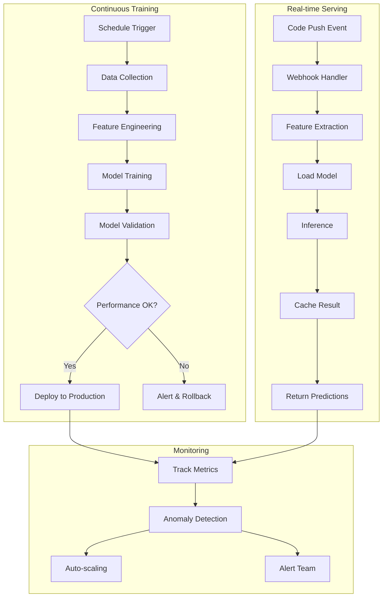

# MLOps Pipeline Implementation Guide

## Pipeline Tools and Technologies

### 1. Data Collection & Ingestion

```yaml
# Apache Kafka Configuration
topics:
  - name: code-commits
    partitions: 10
    retention: 7d
  - name: code-metrics
    partitions: 5
    retention: 30d
  - name: bug-reports
    partitions: 3
    retention: 90d

# Data Sources Integration
sources:
  github:
    webhook_endpoint: /api/v1/github/webhook
    events:
      - push
      - pull_request
      - issues
  gitlab:
    webhook_endpoint: /api/v1/gitlab/webhook
  sonarqube:
    api_endpoint: /api/v1/sonarqube/metrics
    polling_interval: 1h
```

### 2. Feature Engineering Pipeline

```python
# Apache Airflow DAG
from airflow import DAG
from airflow.operators.python import PythonOperator
from datetime import datetime, timedelta

default_args = {
    'owner': 'mlops-team',
    'depends_on_past': False,
    'start_date': datetime(2024, 1, 1),
    'retries': 3,
    'retry_delay': timedelta(minutes=5),
}

dag = DAG(
    'code_quality_feature_pipeline',
    default_args=default_args,
    schedule_interval='@hourly',
    catchup=False
)

# Pipeline stages
extract_code = PythonOperator(
    task_id='extract_code_features',
    python_callable=extract_code_features,
    dag=dag
)

compute_metrics = PythonOperator(
    task_id='compute_complexity_metrics',
    python_callable=compute_complexity_metrics,
    dag=dag
)

detect_patterns = PythonOperator(
    task_id='detect_code_patterns',
    python_callable=detect_code_patterns,
    dag=dag
)

store_features = PythonOperator(
    task_id='store_to_feature_store',
    python_callable=store_to_feature_store,
    dag=dag
)

extract_code >> compute_metrics >> detect_patterns >> store_features
```

### 3. Model Training Pipeline

```yaml
# MLflow Configuration
mlflow:
  tracking_uri: http://mlflow-server:5000
  artifact_store: s3://mlops-artifacts/code-quality
  experiment_name: code_quality_prediction

# Training Configuration
training:
  models:
    - name: bug_predictor
      framework: pytorch
      architecture: transformer
      hyperparameters:
        learning_rate: 0.001
        batch_size: 32
        epochs: 50
    
    - name: complexity_analyzer
      framework: xgboost
      hyperparameters:
        max_depth: 10
        n_estimators: 100
    
    - name: security_scanner
      framework: tensorflow
      architecture: cnn_lstm
      hyperparameters:
        lstm_units: 128
        cnn_filters: 64
```

### 4. Model Serving Infrastructure

```yaml
# Kubernetes Deployment
apiVersion: apps/v1
kind: Deployment
metadata:
  name: code-quality-api
spec:
  replicas: 3
  selector:
    matchLabels:
      app: code-quality-api
  template:
    metadata:
      labels:
        app: code-quality-api
    spec:
      containers:
      - name: api
        image: code-quality-api:latest
        ports:
        - containerPort: 8000
        resources:
          requests:
            memory: "2Gi"
            cpu: "1"
          limits:
            memory: "4Gi"
            cpu: "2"
      - name: model-server
        image: torchserve:latest
        ports:
        - containerPort: 8080
        resources:
          requests:
            memory: "4Gi"
            cpu: "2"
            nvidia.com/gpu: 1
```

### 5. Real-time Inference API

```python
# FastAPI Implementation
from fastapi import FastAPI, HTTPException
from pydantic import BaseModel
import mlflow
import redis
import asyncio

app = FastAPI(title="Code Quality API")
redis_client = redis.Redis(host='redis', port=6379, db=0)

class CodeAnalysisRequest(BaseModel):
    repository: str
    file_path: str
    code_content: str
    commit_hash: str

class CodeQualityResponse(BaseModel):
    bug_probability: float
    complexity_score: float
    security_risks: list
    refactoring_suggestions: list
    technical_debt_score: float

@app.post("/analyze", response_model=CodeQualityResponse)
async def analyze_code(request: CodeAnalysisRequest):
    # Check cache
    cache_key = f"{request.repository}:{request.file_path}:{request.commit_hash}"
    cached_result = redis_client.get(cache_key)
    
    if cached_result:
        return CodeQualityResponse(**json.loads(cached_result))
    
    # Extract features
    features = await extract_features(request.code_content)
    
    # Run inference
    bug_prob = await predict_bugs(features)
    complexity = await analyze_complexity(features)
    security = await scan_security(features)
    refactoring = await suggest_refactoring(features)
    tech_debt = await calculate_tech_debt(features)
    
    response = CodeQualityResponse(
        bug_probability=bug_prob,
        complexity_score=complexity,
        security_risks=security,
        refactoring_suggestions=refactoring,
        technical_debt_score=tech_debt
    )
    
    # Cache result
    redis_client.setex(cache_key, 3600, response.json())
    
    return response
```

### 6. Monitoring Stack

```yaml
# Prometheus Configuration
global:
  scrape_interval: 15s
  evaluation_interval: 15s

scrape_configs:
  - job_name: 'code-quality-api'
    static_configs:
    - targets: ['api:8000']
    
  - job_name: 'model-server'
    static_configs:
    - targets: ['torchserve:8082']
    
  - job_name: 'airflow'
    static_configs:
    - targets: ['airflow:8080']

# Grafana Dashboard Config
dashboards:
  - name: "Code Quality MLOps"
    panels:
      - title: "API Request Rate"
        type: graph
        query: rate(api_requests_total[5m])
      
      - title: "Model Inference Latency"
        type: graph
        query: histogram_quantile(0.95, inference_duration_seconds)
      
      - title: "Bug Detection Accuracy"
        type: stat
        query: avg(bug_detection_accuracy)
      
      - title: "Pipeline Success Rate"
        type: gauge
        query: sum(pipeline_success) / sum(pipeline_total)
```

## Pipeline Orchestration



## Detailed Tool Implementation

### Apache Kafka Setup

```bash
# Docker Compose for Kafka Cluster
version: '3.8'
services:
  zookeeper:
    image: confluentinc/cp-zookeeper:7.5.0
    environment:
      ZOOKEEPER_CLIENT_PORT: 2181
      ZOOKEEPER_TICK_TIME: 2000
    volumes:
      - zookeeper-data:/var/lib/zookeeper/data
      - zookeeper-logs:/var/lib/zookeeper/log

  kafka1:
    image: confluentinc/cp-kafka:7.5.0
    depends_on:
      - zookeeper
    ports:
      - "9092:9092"
    environment:
      KAFKA_BROKER_ID: 1
      KAFKA_ZOOKEEPER_CONNECT: zookeeper:2181
      KAFKA_ADVERTISED_LISTENERS: PLAINTEXT://kafka1:29092,PLAINTEXT_HOST://localhost:9092
      KAFKA_LISTENER_SECURITY_PROTOCOL_MAP: PLAINTEXT:PLAINTEXT,PLAINTEXT_HOST:PLAINTEXT
      KAFKA_INTER_BROKER_LISTENER_NAME: PLAINTEXT
      KAFKA_OFFSETS_TOPIC_REPLICATION_FACTOR: 3
      KAFKA_TRANSACTION_STATE_LOG_MIN_ISR: 2
      KAFKA_TRANSACTION_STATE_LOG_REPLICATION_FACTOR: 3
    volumes:
      - kafka1-data:/var/lib/kafka/data

  kafka2:
    image: confluentinc/cp-kafka:7.5.0
    depends_on:
      - zookeeper
    ports:
      - "9093:9093"
    environment:
      KAFKA_BROKER_ID: 2
      KAFKA_ZOOKEEPER_CONNECT: zookeeper:2181
      KAFKA_ADVERTISED_LISTENERS: PLAINTEXT://kafka2:29093,PLAINTEXT_HOST://localhost:9093
      KAFKA_LISTENER_SECURITY_PROTOCOL_MAP: PLAINTEXT:PLAINTEXT,PLAINTEXT_HOST:PLAINTEXT
      KAFKA_INTER_BROKER_LISTENER_NAME: PLAINTEXT
    volumes:
      - kafka2-data:/var/lib/kafka/data

  kafka3:
    image: confluentinc/cp-kafka:7.5.0
    depends_on:
      - zookeeper
    ports:
      - "9094:9094"
    environment:
      KAFKA_BROKER_ID: 3
      KAFKA_ZOOKEEPER_CONNECT: zookeeper:2181
      KAFKA_ADVERTISED_LISTENERS: PLAINTEXT://kafka3:29094,PLAINTEXT_HOST://localhost:9094
      KAFKA_LISTENER_SECURITY_PROTOCOL_MAP: PLAINTEXT:PLAINTEXT,PLAINTEXT_HOST:PLAINTEXT
      KAFKA_INTER_BROKER_LISTENER_NAME: PLAINTEXT
    volumes:
      - kafka3-data:/var/lib/kafka/data
```

### Apache Airflow Configuration

```python
# airflow.cfg
[core]
executor = KubernetesExecutor
load_examples = False
dags_folder = /opt/airflow/dags

[kubernetes]
namespace = airflow
worker_container_repository = apache/airflow
worker_container_tag = 2.7.0
git_repo = https://github.com/your-org/code-quality-dags
git_branch = main
git_subpath = dags

[scheduler]
scheduler_heartbeat_sec = 5
min_file_process_interval = 30

# DAG for Model Retraining
from airflow.providers.kubernetes.operators.kubernetes_pod import KubernetesPodOperator
from airflow.models import Variable

retraining_dag = DAG(
    'model_retraining_pipeline',
    default_args=default_args,
    schedule_interval='@weekly',
    catchup=False
)

# Data preparation task
data_prep = KubernetesPodOperator(
    task_id='prepare_training_data',
    name='data-preparation',
    namespace='mlops',
    image='code-quality/data-prep:latest',
    cmds=['python', 'prepare_data.py'],
    env_vars={
        'FEATURE_STORE_URI': Variable.get('feature_store_uri'),
        'DATA_LAKE_PATH': Variable.get('data_lake_path')
    },
    resources={
        'request_memory': '4Gi',
        'request_cpu': '2',
        'limit_memory': '8Gi',
        'limit_cpu': '4'
    },
    dag=retraining_dag
)

# Model training task
model_training = KubernetesPodOperator(
    task_id='train_models',
    name='model-training',
    namespace='mlops',
    image='code-quality/model-training:latest',
    cmds=['python', 'train.py'],
    env_vars={
        'MLFLOW_TRACKING_URI': Variable.get('mlflow_uri'),
        'TRAINING_CONFIG': Variable.get('training_config')
    },
    resources={
        'request_memory': '16Gi',
        'request_cpu': '8',
        'limit_memory': '32Gi',
        'limit_cpu': '16',
        'request_gpu': '2'
    },
    dag=retraining_dag
)

# Model validation task
model_validation = KubernetesPodOperator(
    task_id='validate_models',
    name='model-validation',
    namespace='mlops',
    image='code-quality/model-validation:latest',
    cmds=['python', 'validate.py'],
    env_vars={
        'MLFLOW_TRACKING_URI': Variable.get('mlflow_uri'),
        'VALIDATION_THRESHOLD': '0.85'
    },
    dag=retraining_dag
)

data_prep >> model_training >> model_validation
```

### Feature Store Implementation (Feast)

```python
# feature_store.yaml
project: code_quality_mlops
registry: s3://mlops-feature-store/registry.db
provider: aws
online_store:
  type: redis
  connection_string: redis://redis-cluster:6379
offline_store:
  type: file
  
# feature_definitions.py
from feast import Entity, Feature, FeatureView, FileSource, ValueType
from datetime import timedelta

# Define entities
code_file = Entity(
    name="code_file",
    value_type=ValueType.STRING,
    description="Unique identifier for a code file"
)

# Define data sources
code_metrics_source = FileSource(
    path="s3://mlops-data/code_metrics.parquet",
    event_timestamp_column="timestamp",
)

# Define feature views
code_quality_features = FeatureView(
    name="code_quality_features",
    entities=["code_file"],
    ttl=timedelta(days=7),
    features=[
        Feature(name="cyclomatic_complexity", dtype=ValueType.FLOAT),
        Feature(name="lines_of_code", dtype=ValueType.INT64),
        Feature(name="code_duplication", dtype=ValueType.FLOAT),
        Feature(name="test_coverage", dtype=ValueType.FLOAT),
        Feature(name="dependency_count", dtype=ValueType.INT64),
        Feature(name="security_issues", dtype=ValueType.INT64),
        Feature(name="code_smells", dtype=ValueType.INT64),
        Feature(name="technical_debt_minutes", dtype=ValueType.FLOAT),
    ],
    online=True,
    batch_source=code_metrics_source,
    tags={"team": "mlops", "version": "1.0"},
)
```

### MLflow Model Registry

```python
# mlflow_setup.py
import mlflow
import mlflow.pytorch
import mlflow.sklearn
from mlflow.tracking import MlflowClient

# Initialize MLflow
mlflow.set_tracking_uri("http://mlflow-server:5000")
client = MlflowClient()

# Register models
def register_model(model, model_name, stage="Staging"):
    with mlflow.start_run():
        # Log model
        if isinstance(model, torch.nn.Module):
            mlflow.pytorch.log_model(
                model, 
                "model",
                registered_model_name=model_name,
                code_paths=["src/models/"],
                pip_requirements="requirements.txt"
            )
        else:
            mlflow.sklearn.log_model(
                model,
                "model",
                registered_model_name=model_name
            )
        
        # Log metrics
        mlflow.log_metrics({
            "accuracy": 0.92,
            "precision": 0.89,
            "recall": 0.84,
            "f1_score": 0.86
        })
        
        # Log parameters
        mlflow.log_params({
            "model_type": type(model).__name__,
            "training_data": "v2.3",
            "feature_version": "1.0"
        })
    
    # Transition to production
    latest_version = client.get_latest_versions(
        model_name, 
        stages=[stage]
    )[0]
    
    if stage == "Production":
        client.transition_model_version_stage(
            name=model_name,
            version=latest_version.version,
            stage="Production",
            archive_existing_versions=True
        )
```

### Kubernetes Deployment with Helm

```yaml
# helm/code-quality-api/values.yaml
replicaCount: 3

image:
  repository: code-quality/api
  pullPolicy: IfNotPresent
  tag: "1.0.0"

service:
  type: LoadBalancer
  port: 80
  targetPort: 8000

ingress:
  enabled: true
  className: nginx
  annotations:
    cert-manager.io/cluster-issuer: letsencrypt-prod
    nginx.ingress.kubernetes.io/rate-limit: "100"
  hosts:
    - host: api.code-quality.example.com
      paths:
        - path: /
          pathType: Prefix
  tls:
    - secretName: code-quality-tls
      hosts:
        - api.code-quality.example.com

resources:
  limits:
    cpu: 2
    memory: 4Gi
  requests:
    cpu: 1
    memory: 2Gi

autoscaling:
  enabled: true
  minReplicas: 3
  maxReplicas: 20
  targetCPUUtilizationPercentage: 70
  targetMemoryUtilizationPercentage: 80

# Model serving configuration
modelServing:
  enabled: true
  torchserve:
    models:
      - name: bug-predictor
        url: s3://models/bug-predictor.mar
        workers: 4
      - name: complexity-analyzer
        url: s3://models/complexity.mar
        workers: 2
    resources:
      limits:
        nvidia.com/gpu: 2
        memory: 16Gi
      requests:
        nvidia.com/gpu: 1
        memory: 8Gi
```

### Monitoring and Alerting Setup

```yaml
# prometheus-rules.yaml
apiVersion: monitoring.coreos.com/v1
kind: PrometheusRule
metadata:
  name: code-quality-alerts
spec:
  groups:
  - name: api_alerts
    interval: 30s
    rules:
    - alert: HighErrorRate
      expr: rate(http_requests_total{status=~"5.."}[5m]) > 0.05
      for: 5m
      labels:
        severity: critical
      annotations:
        summary: "High error rate detected"
        description: "Error rate is above 5% for 5 minutes"
    
    - alert: HighLatency
      expr: histogram_quantile(0.95, http_request_duration_seconds_bucket) > 2
      for: 10m
      labels:
        severity: warning
      annotations:
        summary: "High API latency"
        description: "95th percentile latency is above 2 seconds"
    
    - alert: ModelDriftDetected
      expr: model_prediction_drift > 0.1
      for: 30m
      labels:
        severity: warning
      annotations:
        summary: "Model drift detected"
        description: "Model predictions have drifted by more than 10%"

# grafana-dashboard.json
{
  "dashboard": {
    "title": "Code Quality MLOps Dashboard",
    "panels": [
      {
        "title": "Request Rate",
        "targets": [
          {
            "expr": "sum(rate(http_requests_total[5m])) by (service)"
          }
        ]
      },
      {
        "title": "Model Inference Latency",
        "targets": [
          {
            "expr": "histogram_quantile(0.99, sum(rate(model_inference_duration_seconds_bucket[5m])) by (le, model))"
          }
        ]
      },
      {
        "title": "Bug Detection Accuracy",
        "targets": [
          {
            "expr": "avg_over_time(bug_detection_accuracy[1h])"
          }
        ]
      },
      {
        "title": "Resource Utilization",
        "targets": [
          {
            "expr": "sum(container_memory_usage_bytes) by (pod) / sum(container_spec_memory_limit_bytes) by (pod)"
          }
        ]
      }
    ]
  }
}
```

## CI/CD Pipeline

```yaml
# .gitlab-ci.yml
stages:
  - test
  - build
  - deploy
  - monitoring

variables:
  DOCKER_REGISTRY: registry.example.com
  KUBERNETES_NAMESPACE: code-quality-prod

# Test stage
test:models:
  stage: test
  image: python:3.9
  script:
    - pip install -r requirements-test.txt
    - pytest tests/models/ --cov=src/models
    - python -m mypy src/models/
  artifacts:
    reports:
      coverage_report:
        coverage_format: cobertura
        path: coverage.xml

# Build stage
build:api:
  stage: build
  image: docker:20.10
  services:
    - docker:dind
  script:
    - docker build -t $DOCKER_REGISTRY/code-quality-api:$CI_COMMIT_SHA .
    - docker push $DOCKER_REGISTRY/code-quality-api:$CI_COMMIT_SHA

build:models:
  stage: build
  image: python:3.9
  script:
    - pip install torch-model-archiver
    - torch-model-archiver --model-name bug_predictor --version 1.0 
      --model-file src/models/bug_predictor.py 
      --serialized-file models/bug_predictor.pt
      --handler src/handlers/bug_handler.py
    - aws s3 cp bug_predictor.mar s3://models/bug_predictor.mar

# Deploy stage
deploy:production:
  stage: deploy
  image: bitnami/kubectl:latest
  script:
    - kubectl set image deployment/code-quality-api 
      api=$DOCKER_REGISTRY/code-quality-api:$CI_COMMIT_SHA 
      -n $KUBERNETES_NAMESPACE
    - kubectl rollout status deployment/code-quality-api -n $KUBERNETES_NAMESPACE
  only:
    - main

# Monitoring stage
validate:deployment:
  stage: monitoring
  image: curlimages/curl:latest
  script:
    - |
      for i in {1..10}; do
        response=$(curl -s -o /dev/null -w "%{http_code}" https://api.code-quality.example.com/health)
        if [ "$response" != "200" ]; then
          echo "Health check failed with status $response"
          exit 1
        fi
        sleep 30
      done
  only:
    - main
```